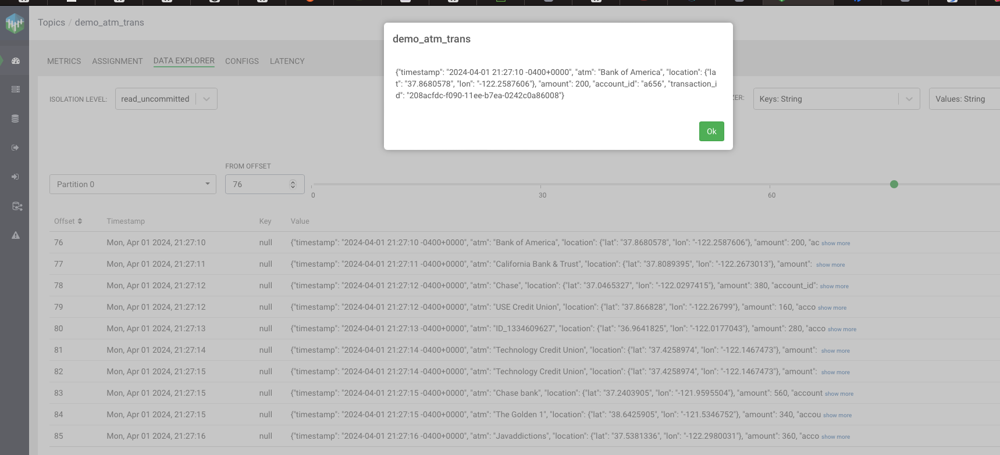

### Simulate financial transactions (ATM withdrawals) as generated JSON 
```
{   
  "account_id": "a228",
  "timestamp": "2018-10-05T10:47:54.189407",
  "atm": "Bank of the West",
  "amount": 300,
  "location": {
     lat: "37.2500148",
     lon: "-121.8621345"
  },
  "transaction_id": "bb35284a-c883-11e8-8421-186590d22a35"
}
```

### Push the transactions to a Kafka topic
<br>

### Customize the street maps (OSM) used
```
Extending ATM locations

If you want to add new ATM locations, then you need to do the following:

1. Choose a geographic area and download the respective `.osm` dump from sites such as 
    * https://export.hotosm.org/en/v3/
        * (e.g. https://export.hotosm.org/en/v3/exports/7e60635f-18b4-4650-9146-68c72a3a6c65)
        * From HOTOSM you can opt to download _just_ ATM points, which makes the file smaller
    * https://archive.org/download/metro.teczno.com
    * https://osmaxx.hsr.ch/
2. Then, run `data/extract_atms.py`, which uses the ATM-tagged nodes in [OSM/XML](http://wiki.openstreetmap.org/wiki/OSM_XML) format and extracts/converts it into the [CSV format](data/osm-atm-garmin.csv) used internally, by gess.
3. You can also download KML format data and use the `extract_atms_kml.py` script (`pykml` was an easier library to install than the `imposm` library required for OSM)
4. Add the generated ATM location data file in CSV format to `gess.conf` so that gess picks it up on startup time.
```

### Build the project
```
git clone https://github.com/kentontroy/simulator_fraudulent_transactions
cd simulator_fraudulent_transactions 
docker build -t centos7-base-image:latest -f docker/Dockerfile-base-image --no-cache .
DOCKER_BUILDKIT=1 docker build -t kafka-producer:latest -f docker/Dockerfile-kafka-producer --no-cache .
docker-compose -f docker/docker-compose.yml up

docker inspect --format="{{json .NetworkSettings}}" docker-kafka-1 | python3 -m json.tool
 .....
 "Networks": {
        "docker_csp-ce-net": {
            "IPAMConfig": null,
            "Links": null,
            "Aliases": [
                "docker-kafka-producer-1",
                "kafka-producer",
                "78dae288bebc"
            ],
            "NetworkID": "9255bb4f251b2a82b873dabeb64960c81b6ca1514e7a20b68a7db518623785b7",
            "EndpointID": "040751f03e0dccecde132d6c419bb066c37e0a93a39ce8c36eee83736e2783e7",
            "Gateway": "192.168.112.6",
            "IPAddress": "192.168.96.8",
            "IPPrefixLen": 20,
            "IPv6Gateway": "",
            "GlobalIPv6Address": "",
            "GlobalIPv6PrefixLen": 0,
            "MacAddress": "02:42:c0:a8:60:08",
            "DriverOpts": null
        }
    }

export DOCKER_KAFKA_HOST_IP=`docker inspect --format="{{json .NetworkSettings}}" docker-kafka-1 | python3 src/parseNetworkIP.py`
echo ${DOCKER_KAFKA_HOST_IP}
192.168.112.6

export DOCKER_KAFKA_CMD="sh -c './sim.sh start && nc -u -l 6901 | ./kafka/bin/kafka-console-producer.sh --topic demo_atm_trans --bootstrap-server ${DOCKER_KAFKA_HOST_IP}:9092'"
echo ${DOCKER_KAFKA_CMD} > scripts/simKafkaProducer.sh
cat scripts/simKafkaProducer.sh

docker cp scripts/simKafkaProducer.sh docker-kafka-producer-1:/usr/src/app
docker-compose -f docker/docker-compose.yml exec kafka-producer sh simKafkaProducer.sh

```
### Create a Kafka table that maps to a Kafka topic
```
Consider a Kafka table as a construct that can be continuously queried by a Flink job
The job is essentially creating a stream with fields that are projected from a query
against that table. A typical use case is to derive one stream from another. For example,
time series data can be very granular down to the second or millisecond for capturing an
event. Time series analysis may benefit from downsampling or aggregating the data into
summaries by the hour or some high level of precision.
```
<br>

DDL for the Kafka table is automatically generated as:
<br>

### Create a materialized view on top of the Kafka table via an SSB job
<br>

### Create a REST Endpoint on top of the materialized view
<br>

### View data from the REST endpoint in a browser window
```
http://localhost:18131/api/v1/query/5195/summary?key=e148580d-875a-4906-b46c-f6e28b3990e8&limit=100

```